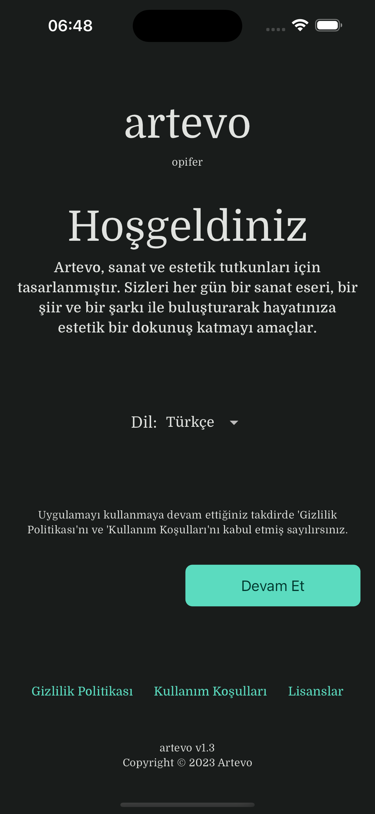
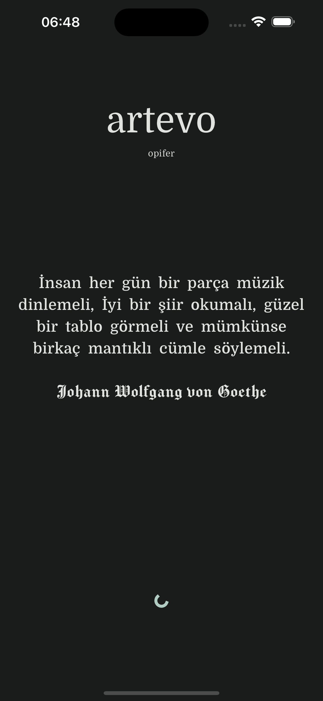
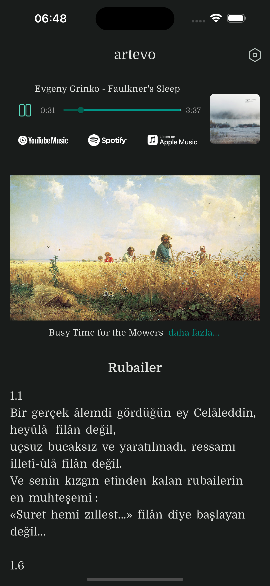
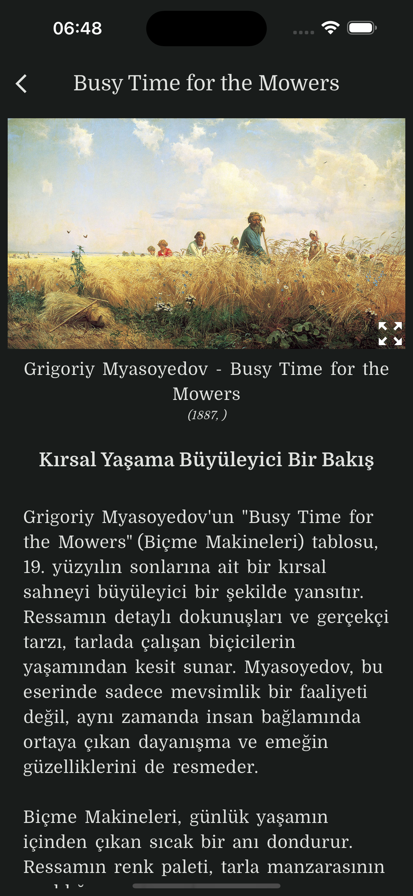
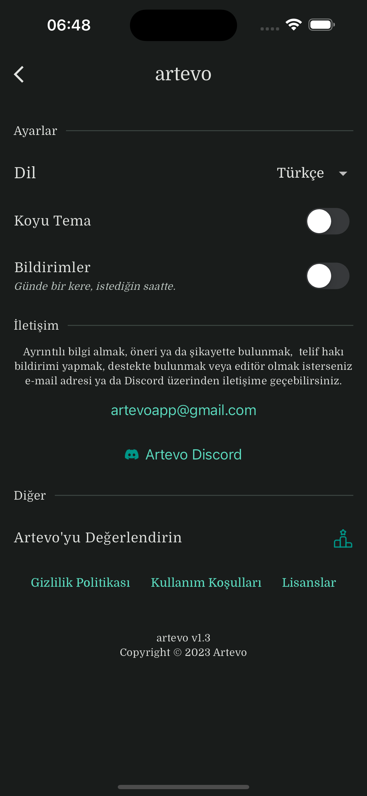

# Artevo: Günlük Estetik Seçkiler

>İnsan her gün bir parça müzik dinlemeli, iyi bir şiir okumalı, güzel bir tablo görmeli ve mümkünse birkaç mantıklı cümle söylemeli.

— Johann Wolfgang von Goethe, Wilhelm Meister'ın Çıraklığı

<a href= "https://artevoapp.github.io/">Artevo</a>, sizleri her gün bir sanat eseri, bir şiir ve bir şarkı ile buluşturarak hayatınıza estetik bir dokunuş katmayı amaçlar.

## Kullanılan Teknolojiler
Flutter (Dart) ile geliştirildi. Kullanılan paketler için `pupspec.yaml` dosyasına bakabilirsiniz.

## İndir 

## Ekran Görüntüleri

    
    
    
    
    
    
     
    
    

## Diğer Bağlantılar
https://artevoapp.github.io/

https://github.com/ArtevoApp
